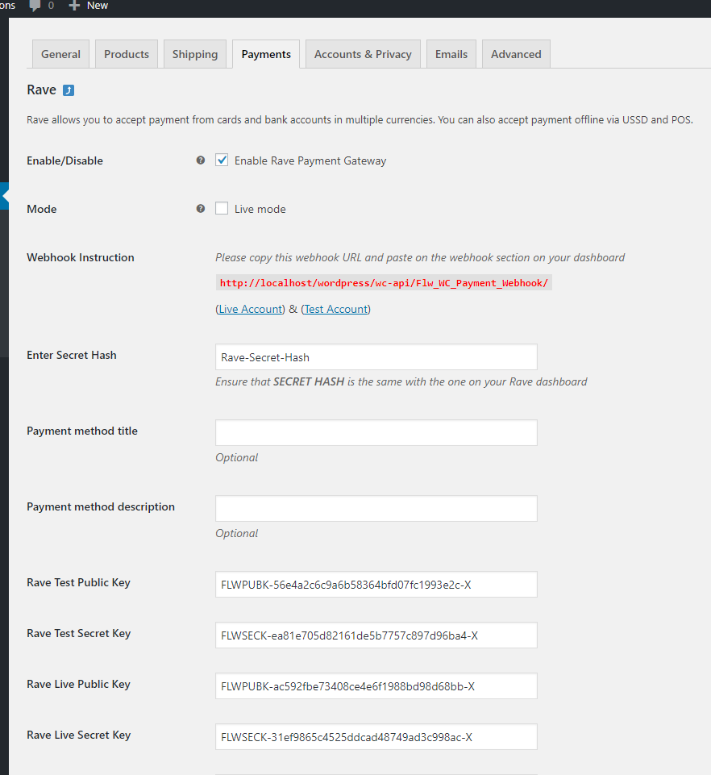
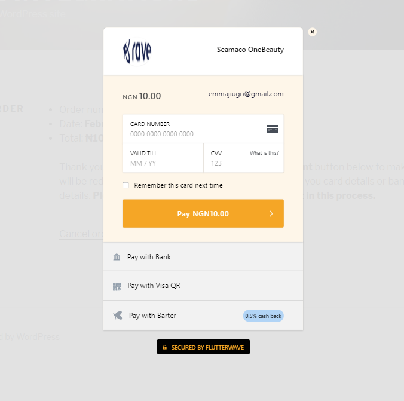

# Flutterwave

 - **Contributors:** Flutterwave Developers
 - **Tags:** flutterwave woocommerce, payment gateway, bank account, credit card, debit card, nigeria, kenya, international, mastercard, visa, barter, PayPal
 - **Requires at least:** 4.4
 - **Tested up to:** 5.7
 - **Stable tag:** 1.0.0
 - **License:** MIT - see below

Take payments on your store using Flutterwave.

## Description

Accept Credit card, Debit card and Bank account payment directly on your store with the Flutterwave for WooCommerce.

#### Take Credit card payments easily and directly on your store

Signup for an account [here](https://dashboard.flutterwave.com)

Flutterwave for business is available in:

* __Nigeria__
* __Ghana__
* __Kenya__
* __Uganda__
* __Tanzania__
* __Rwanda__
* __South Africa__
* __Cameroon__
* __Senegal__
* __Mali__

## Installation

### Automatic Installation
*   Login to your WordPress Dashboard.
*   Click on "Plugins > Add New" from the left menu.
*   In the search box type __Flutterwave__.
*   Click on __Install Now__ on __Flutterwave__ to install the plugin on your site.
*   Confirm the installation.
*   Activate the plugin.
*   Click on "WooCommerce > Settings" from the left menu and click the __"Payments"__ tab.
*   Click on the __Flutterwave__ link from the available Checkout Options
*   Configure your __Flutterwave__ settings accordingly.

### Manual Installation
*  Download the plugin zip file.
*  Login to your WordPress Admin. Click on "Plugins > Add New" from the left menu.
*  Click on the "Upload" option, then click "Choose File" to select the zip file you downloaded. Click "OK" and "Install Now" to complete the installation.
*  Activate the plugin.
*  Click on "WooCommerce > Settings" from the left menu and click the __"Payments"__ tab.
*  Click on the __Flutterwave__ link from the available Checkout Options
*  Configure your __Flutterwave__ settings accordingly.

For FTP manual installation, [check here](http://codex.wordpress.org/Managing_Plugins#Manual_Plugin_Installation).

### Configure the plugin
To configure the plugin, go to __WooCommerce > Settings__ from the left menu, click __Payments__ tab. Click on __Flutterwave__.

* __Enable/Disable__ - check the box to enable Flutterwave.
* __Mode__ - check the box to enable Live Mode.
* __Webhook Instruction__ - please ensure that you copied the url displayed in red into your Flutterwave dashboard as described.
* __Enter Secret Hash__ - ensure that secret hash entered is the same with the one on your Flutterwave dashboard.
* __Test Public Key__ - enter your test public key dashboard.flutterwave.com.
* __Test Secret Key__ - enter your test secret key dashboard.flutterwave.com.
* __Live Public Key__ - enter your live public key dashboard.flutterwave.com.
* __Live Secret Key__ - enter your live secret key dashboard.flutterwave.com.
* Click __Save Changes__ to save your changes.

## Screenshots ##

#####1. Flutterwave Setting Page
###

#####2. Flutterwave option on woocommerce order checkout page
###

#####3. Flutterwave payment modal showing multiple payment options
###

### Suggestions / Contributions

To contribute, fork the repo, add your changes and modifications then create a pull request.

### License

##### MIT License

Permission is hereby granted, free of charge, to any person obtaining a copy
of this software and associated documentation files (the "Software"), to deal
in the Software without restriction, including without limitation the rights
to use, copy, modify, merge, publish, distribute, sublicense, and/or sell
copies of the Software, and to permit persons to whom the Software is
furnished to do so, subject to the following conditions:

The above copyright notice and this permission notice shall be included in all
copies or substantial portions of the Software.

THE SOFTWARE IS PROVIDED "AS IS", WITHOUT WARRANTY OF ANY KIND, EXPRESS OR
IMPLIED, INCLUDING BUT NOT LIMITED TO THE WARRANTIES OF MERCHANTABILITY,
FITNESS FOR A PARTICULAR PURPOSE AND NONINFRINGEMENT. IN NO EVENT SHALL THE
AUTHORS OR COPYRIGHT HOLDERS BE LIABLE FOR ANY CLAIM, DAMAGES OR OTHER
LIABILITY, WHETHER IN AN ACTION OF CONTRACT, TORT OR OTHERWISE, ARISING FROM,
OUT OF OR IN CONNECTION WITH THE SOFTWARE OR THE USE OR OTHER DEALINGS IN THE
SOFTWARE.
